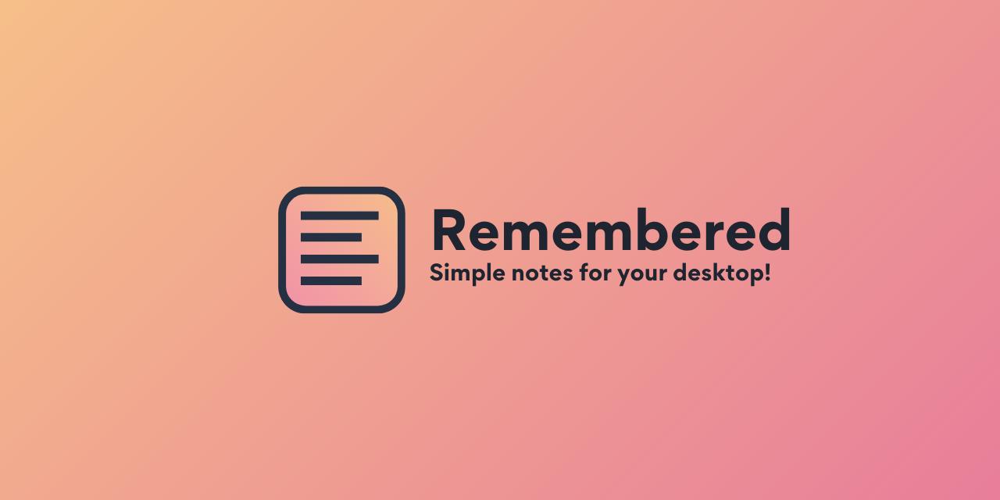
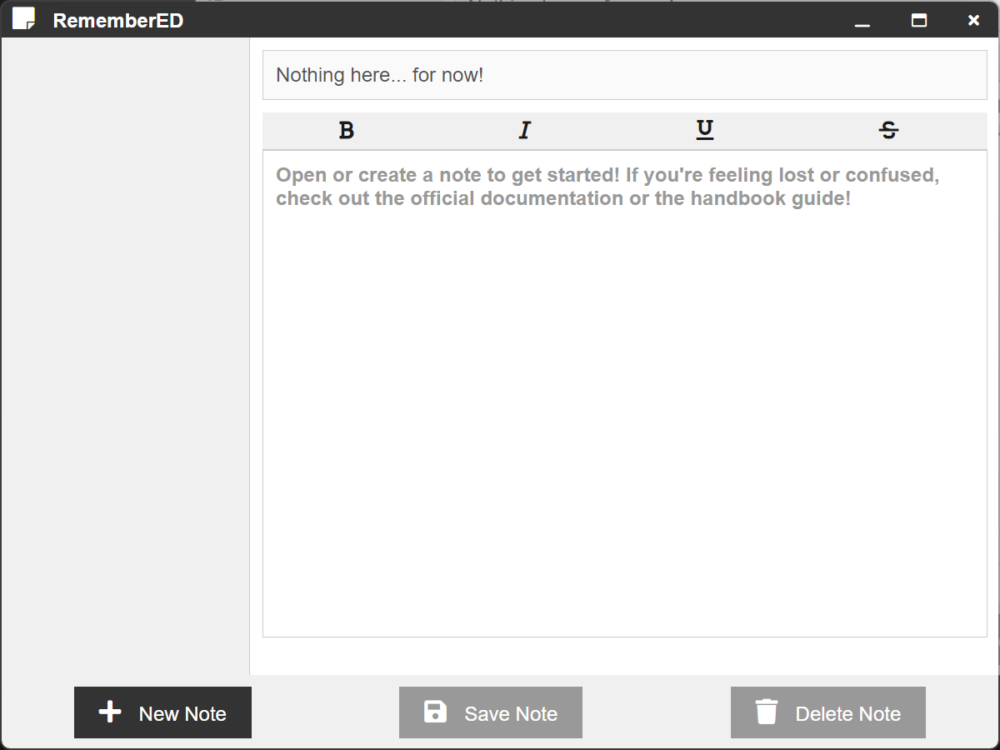
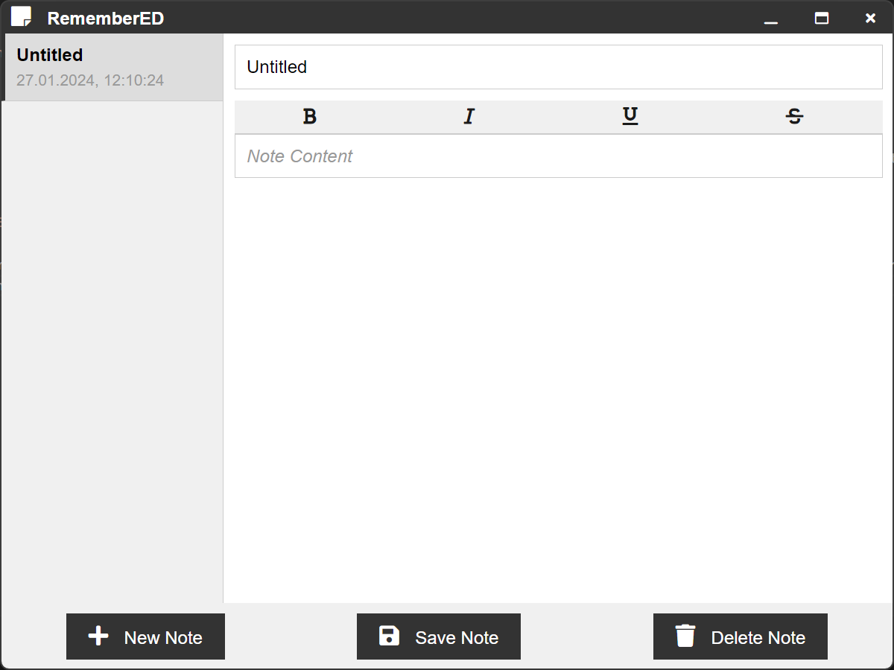
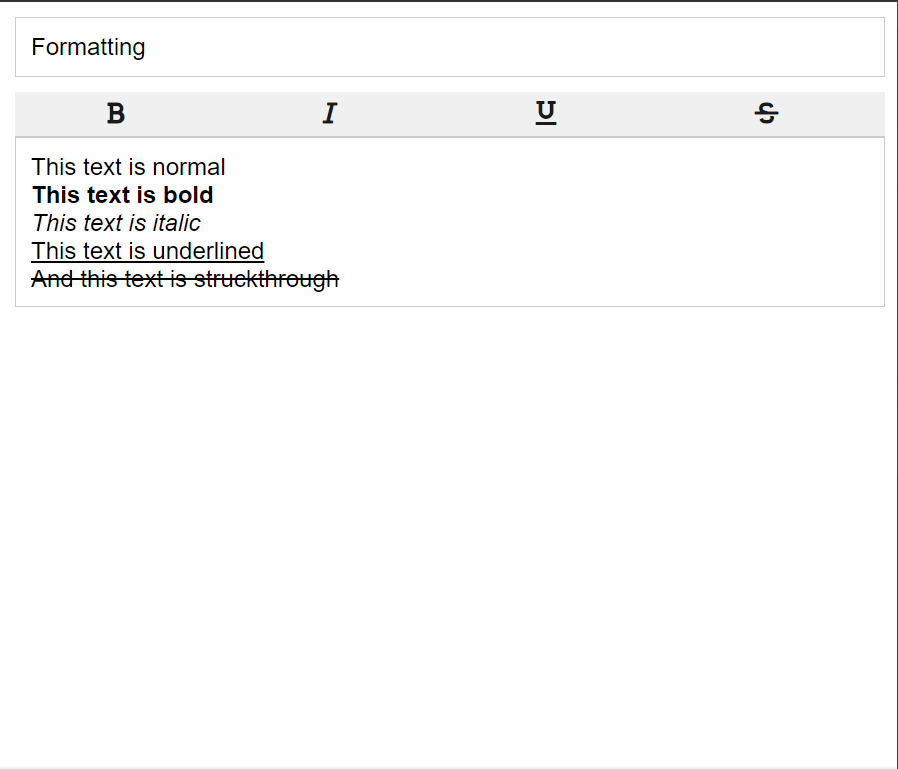

# RememberED

Welcome to RememberED, a desktop application that helps you note stuff down and remember them later, with enabled formatting options and several other customization tools. It is optimized for use via a clean GUI, written in Node.js and Electron. Soon enough, we'll also support features like voice recognition and sticky notes!



## Installation

At the moment, the app is only installable via the source code. We'll soon be releasing the binaries on our website (work in progress). To install the app, you'll need to have Node.js installed on your system. If you don't have it, you can download it from [here](https://nodejs.org/en/download/). Once you have it installed, you can clone the repository and install the dependencies by running the following commands in your terminal:

```bash
git clone https://github.com/LyubomirT/remembered.git
``` 

```bash
cd remembered
```

```bash
npm install
```

Pretty simple, right? Now, you can run the app by running the following command:

```bash
npm run run
```

## Usage

The app is pretty simple to use, but if you need a tutorial, this section is the right place! When you first open the app, you'll probably see something like this:



### Getting Started

As the prompt suggests, you can get started by clicking on the "New Note" button in the bottom left-hand corner. This will open a new window, where you can start typing your note. After creating one, it will appear in the list on the left as "Untitled". You can go ahead and click on it to open it. You'll see this:



Each note consists of a name (title) and a description (or content). By default, these are "Untitled" and... Nothing. So each time you create a note, you'll have to change these. The name can be customized by clicking and typing something in top bar (the little one). The description isn't required and can be modified by typing in the large text area (it also resizes along with your note if you have something HUGE to write down in there).

When you're done with your changes, you need to save them by clicking the "Save Note" button in the bottom. But please make sure that a note is opened before you use it, because otherwise it'll be grayed out and you won't be able to click it. Notes are saved in the `notetaker.json` file in the root directory of the app, you can delete the file itself if you want to get rid of all your notes at once.

### Formatting

Take a look at this image:



You can see that the text in the note is formatted differently. This is because we have a formatting toolbar, which you can use to customize your text. It currently supports some basic text formatting. The toolbar is pretty self-explanatory, so I won't go into much detail here.

### In-App Help

If you're stuck somewhere, you can always click on the "Help" button in the bottom right-hand corner. This will open a context menu with some useful links, redirecting you to the information you need. We'll be adding more links in the future, so stay tuned!

### Contributing

Since this is a work in progress, we'd love to see your contributions! If you want to contribute, you can do so by forking the repository and creating a pull request. We'll review it and merge it if it's good enough. If you want to contribute, but don't know where to start, you can check out the [issues](https://github.com/LyubomirT/remembered/issues) page for some ideas. If you have any questions, feel free to contact us via email or open an issue.

### License

We're using the GPL-3.0 license for this project. You can read more about it [here](LICENSE).

### Credits

#### Handbook

- [Github Markdown CSS](https://github.com/sindresorhus/github-markdown-css)
- [Font Awesome](https://fontawesome.com/)
- [Markdown-it](https://github.com/markdown-it/markdown-it)

#### RememberED

- [Electron](https://www.electronjs.org/)
- [Node.js](https://nodejs.org/en/)
- [Font Awesome](https://fontawesome.com/)

#### Contributors

<a href="https://github.com/LyubomirT/remembered/graphs/contributors">
  
</a>

### Contact Us

Currently, you can contact us (well, just me for now) via email at [ternavski103@gmail.com](mailto:ternavski103@gmail.com) or Discord at `@lyubomirt`. We'll be adding more ways to contact us in the future, including a dedicated chat on our website, which is currently in development.